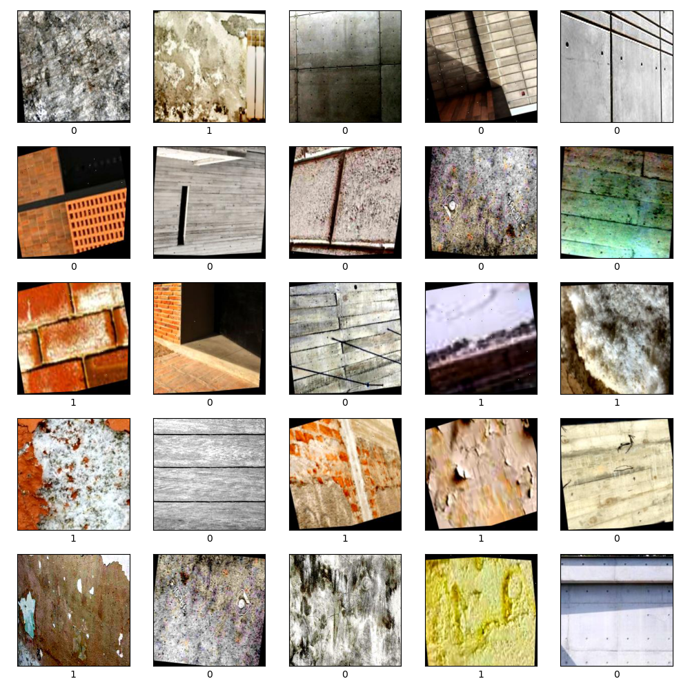

# Chloride Damage Classification with Convolutional Neural Network 🏫

Researchers 🧑‍🔬
- *Dr. José A. Guzmán-Torres*  
jose.alberto.guzman@umich.mx  
https://orcid.org/0000-0002-9309-9390

- *Dr. Francisco J. Domínguez-Mota*  
francisco.mota@umich.mx  
https://orcid.org/0000-0001-6837-172X
- *Dr. Gerardo Tinoco-Guerrero*  
gerardo.tinoco@umich.mx  
https://orcid.org/0000-0003-3119-770X
- Dra. Elia Mercedes Alonso Guzmán  
elia.alonso@umich.mx  
https://orcid.org/0000-0002-8502-4313
- Dr. Wilfrido Martínez Molina  
wilfrido.martinez@umich.mx  
https://orcid.org/0000-0002-3301-4949

*Universidad Michoacana de San Nicolás de Hidalgo, Faculty of Civil Engineering*  
*AULA-CIMNE, Morelia, Michoacán, México*  
*Researchers National System México*

## Description: 📝
This repository contains a convolutional neural network (CNN) model designed to classify chloride-induced damage in concrete using a dataset of images. The model aims to assist in identifying and categorizing damage levels to aid in the maintenance and evaluation of concrete structures.

## Project Summary 📚
The primary goal of this project is to develop a robust CNN capable of accurately classifying various levels of chloride damage in concrete. This tool will be invaluable for researchers and engineers focused on infrastructure safety and durability.

## Dataset Description 🔥
The dataset includes images of concrete samples with varying levels of chloride-induced damage. Each image is labeled with the corresponding damage level, facilitating supervised learning for model training.

## Benefits for the Machine Learning Community ✨
Benchmarking: Use this dataset to evaluate the performance of different CNN models in classifying chloride damage in concrete.
Model Development: Train and develop new models to improve accuracy in damage classification, contributing to better maintenance strategies for concrete structures.

## Repository Contents ✍️
Civil-damage-dataset: Directory containing the images of concrete samples divided in train, testing, and validation.

Model.py: Script for training the CNN model.
README.md: This document.
